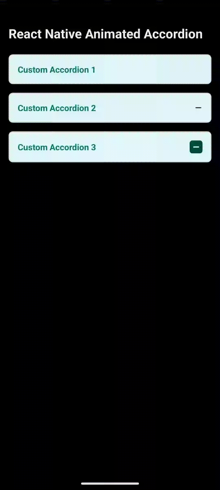

# react-native-custom-animated-accordion

A custom React Native component for creating an animated accordion with expandable content and smooth transitions.

## Installation

Install the package using either npm or yarn:

### Using npm:

```javascript
npm install react-native-custom-animated-accordion react-native-reanimated
```

### or Using yarn:

```javascript
yarn add react-native-custom-animated-accordion react-native-reanimated
```

## Usage

To implement the `Accordion` component in your React Native project, follow the example below:

### Import the Component

```javascript
import React from "react";
import { View, Text, StyleSheet } from "react-native";
import Accordion from "react-native-custom-animated-accordion";
import ICONS from "./path/to/icons"; // Adjust the path as needed

const App = () => {
  return (
    <View style={styles.container}>
      <Accordion
        maxHeight={90}
        title="Custom Accordion 3"
        iconSourceOpen={ICONS.plus}
        bodyStyle={styles.customBody}
        iconStyle={styles.customImage}
        iconSourceClosed={ICONS.minus}
        titleStyle={styles.customTitle}
        headerStyle={styles.customHeader}
        iconTextStyle={styles.customIconText}
        iconViewStyle={styles.customIconView}
        containerStyle={styles.customContainerStyle}
      >
        <Text style={{ padding: 16, color: "#004d40" }}>
          This is the content of the accordion 3.
        </Text>
      </Accordion>
    </View>
  );
};

const styles = StyleSheet.create({
  container: {
    borderRadius: 8,
    marginVertical: 8,
    overflow: "hidden",
    borderColor: "#ddd",
  },
  customBody: {
    backgroundColor: "#f0f0f0",
  },
  customImage: {
    width: 20,
    height: 20,
  },
  customTitle: {
    color: "#333",
    fontSize: 18,
  },
  customHeader: {
    backgroundColor: "#e0e0e0",
  },
  customIconText: {
    fontSize: 16,
    color: "#333",
  },
  customIconView: {
    padding: 10,
  },
  customContainerStyle: {
    borderWidth: 1,
    borderColor: "#ddd",
    borderRadius: 8,
  },
});

export default App;
```

### Example

Here is an example of how to use the `Accordion` component:

 

# Props

Below is a detailed explanation of all the props used in the `Accordion` component.

## Props

| Prop               | Type              | Default    | Description                                                 |
| ------------------ | ----------------- | ---------- | ----------------------------------------------------------- |
| `title`            | `string`          | `""`       | The text to display as the accordion header.                |
| `maxHeight`        | `number`          | `100`      | Maximum height of the accordion when expanded.              |
| `rotateEnd`        | `string`          | `'180deg'` | Rotation angle when the accordion is fully opened.          |
| `rotateStart`      | `string`          | `'0deg'`   | Rotation angle when the accordion is closed.                |
| `bodyStyle`        | `ViewStyle`       | `{}`       | Custom styles for the accordion body container.             |
| `iconStyle`        | `ViewStyle`       | `{}`       | Custom styles for the icon image in the accordion header.   |
| `titleStyle`       | `TextStyle`       | `{}`       | Custom styles for the title text in the accordion header.   |
| `iconSourceOpen`   | `string`          | `null`     | The image source for the icon when the accordion is opened. |
| `headerStyle`      | `ViewStyle`       | `{}`       | Custom styles for the accordion header.                     |
| `iconSourceClosed` | `string`          | `null`     | The image source for the icon when the accordion is closed. |
| `iconViewStyle`    | `ViewStyle`       | `{}`       | Custom styles for the view containing the icon.             |
| `containerStyle`   | `ViewStyle`       | `{}`       | Custom styles for the accordion container.                  |
| `children`         | `React.ReactNode` | `null`     | Content to be rendered inside the accordion when expanded.  |

## Usage Example

## License

This project is licensed under the MIT License.

## Contact

For questions or issues, please visit the [GitHub issues page](https://github.com/mehuljetani/react-native-custom-animated-accordion/issues).
